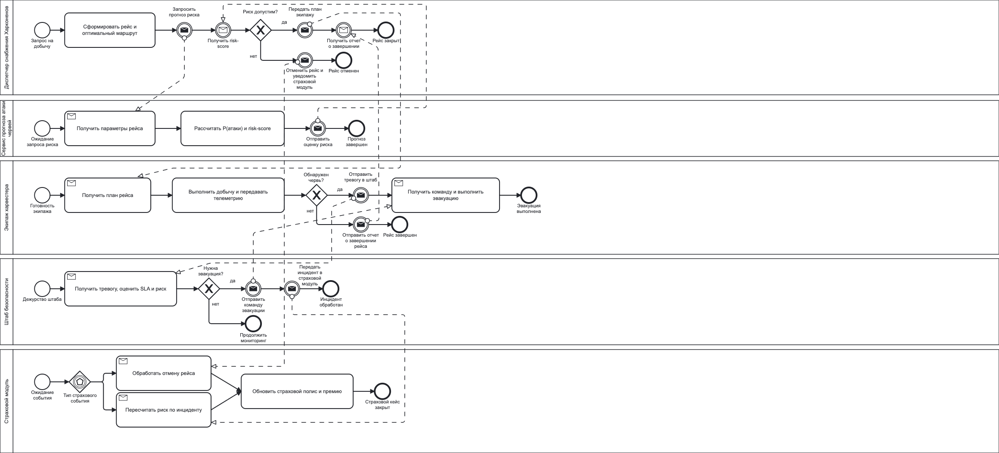

# Проект по вселенной: «Дюна»
## Система управления снабжением Харконенов

## Описание
«Система управления снабжением Харконенов» — это интерактивная информационная платформа для координации добычи пряности на Арракисе в условиях постоянной угрозы песчаных червей. Система автоматизирует планирование рейсов харвестеров, расчет вероятности атаки, запуск эвакуационных триггеров и страховой риск-скоринг. Платформа поддерживает событийную модель взаимодействия (event-driven architecture), что позволяет в реальном времени реагировать на угрозы, эскалировать инциденты по SLA и снижать потери техники и экипажей.

## BPMN диаграмма

Исходник BPMN: [`process-2.bpmn`](./process.bpmn)

## Роли

### 1. Роль: Диспетчер снабжения Харконенов
Функционал:
- Создать рейс добычи.
- Сформировать и оптимизировать маршрут харвестера.
- Запросить прогноз вероятности атаки и `risk-score`.
- Принять решение о запуске рейса или отмене.
- Закрыть рейс после получения отчета экипажа.

### 2. Роль: Сервис прогноза атаки червей
Функционал:
- Получить параметры рейса от диспетчера.
- Рассчитать вероятность атаки червя `P(attack)`.
- Рассчитать страховой `risk-score`.
- Вернуть оценку риска в контур принятия решения.

### 3. Роль: Экипажа харвестера
Функционал:
- Получить план рейса и окно добычи.
- Выполнять добычу с передачей телеметрии.
- Отправить тревожный сигнал при обнаружении червя.
- Выполнить эвакуацию по команде штаба.
- Передать отчет о завершении рейса.

### 4. Роль: Штаб безопасности
Функционал:
- Обработать тревожные события от экипажа.
- Проверить выполнение SLA реакции.
- Принять решение о запуске эвакуации.
- Передать команду на эвакуацию.
- Передать инцидент в страховой модуль.

### 5. Роль: Страховой модуль
Функционал:
- Обработать отмену рейса из-за высокого риска.
- Пересчитать риск по аварийному инциденту.
- Обновить страховой полис и премию.
- Закрыть страховой кейс по рейсу.
